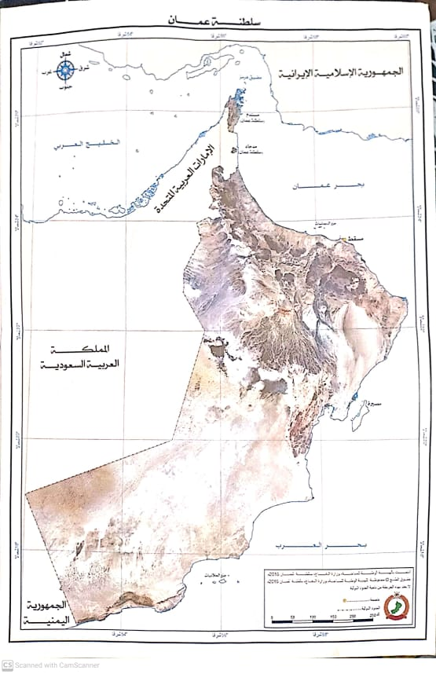

# Oman-Maps
An Argumented reality App that utilizes map box APIs to scan hard color printed maps to display cities 
The app uses
- map box API
- Vuforia camera
- C#

This prototype currently displays the cities, population, touristis places on reality.
In future i hope to integrate google maps API so that it can help tourists traveling to places using the maps
Currently helps Primary kids in Oman to undersatand their geographical features.

# one can download this map and print it with colors 

# Running the app shows three buttons
- **cities information**

- **cities**

- **Geographical features in Oman**

